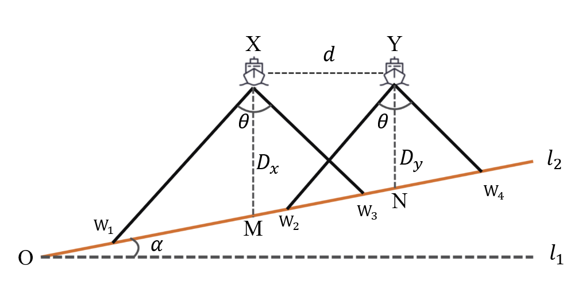
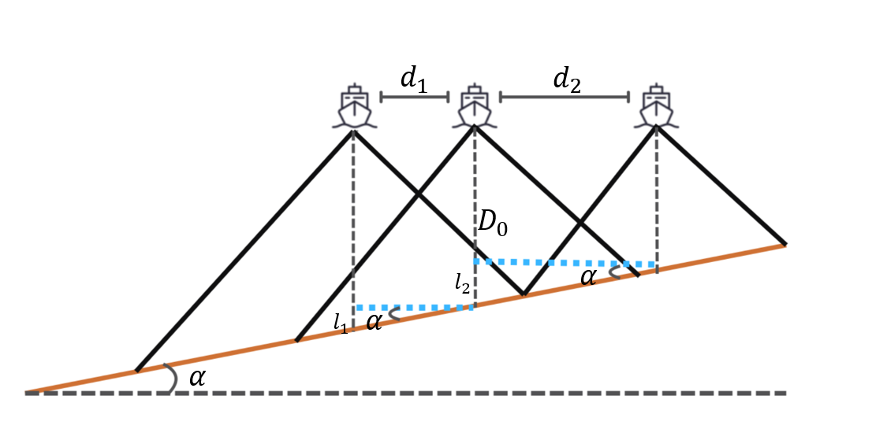
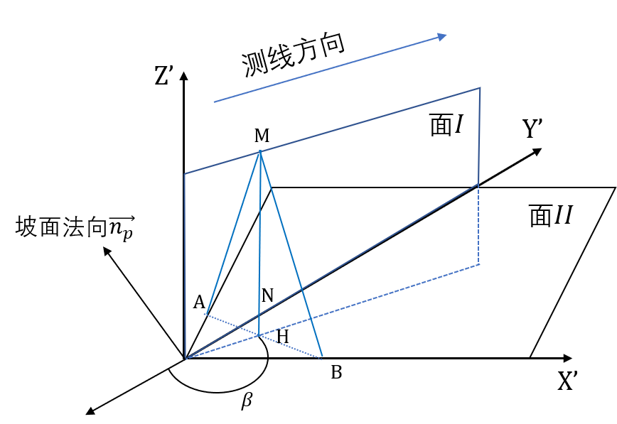
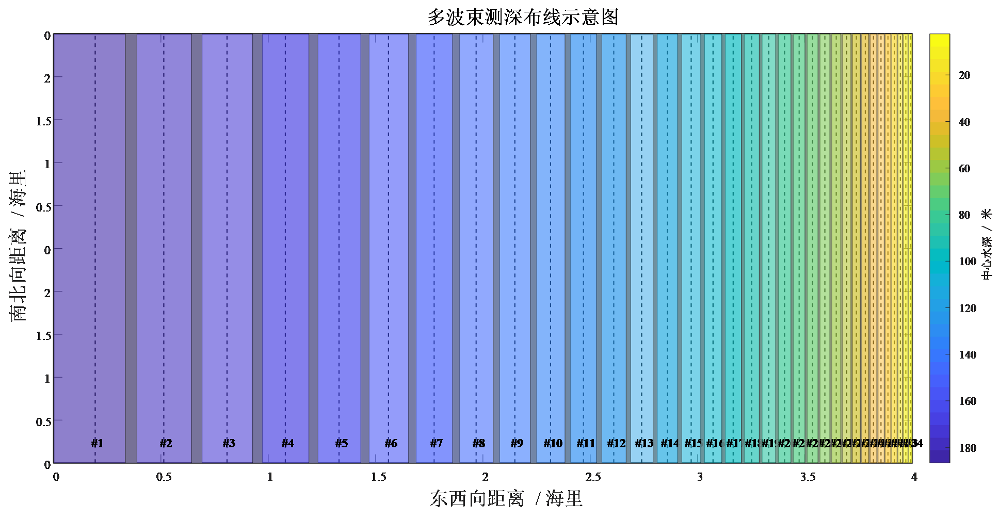
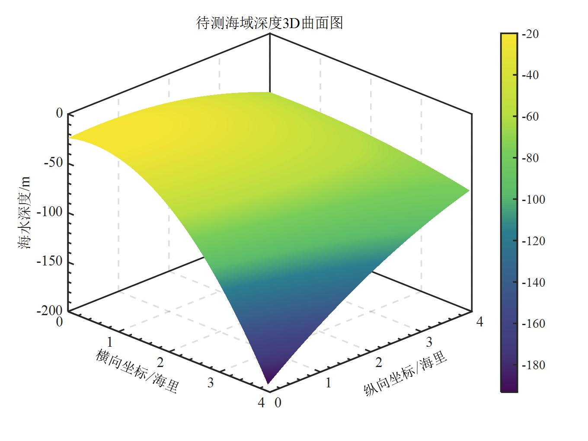
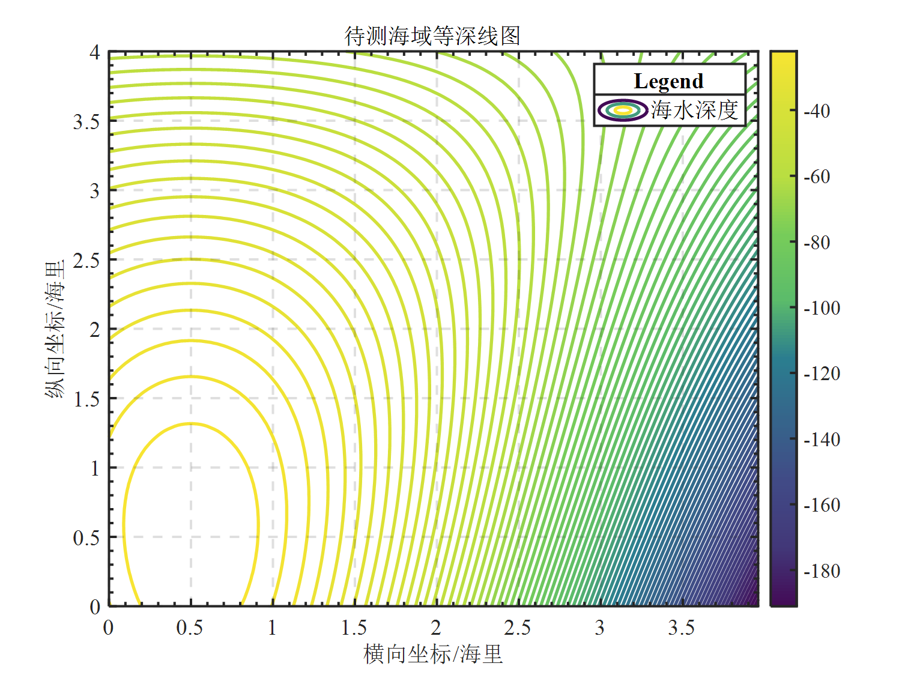
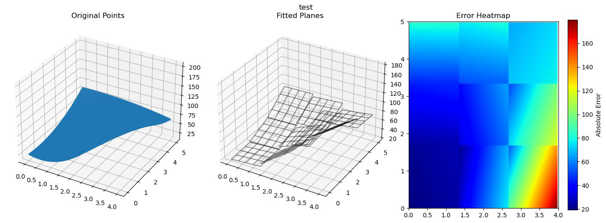
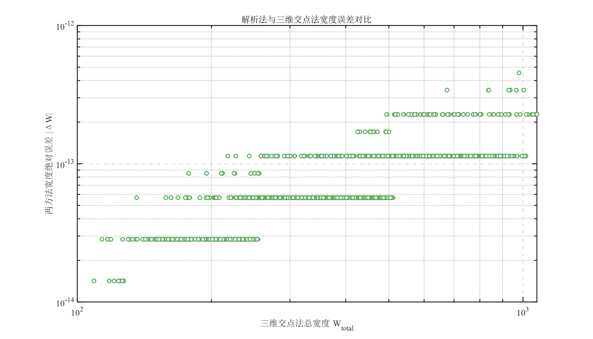
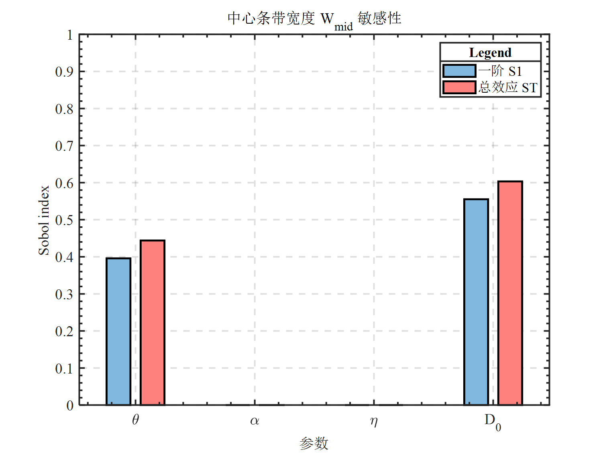
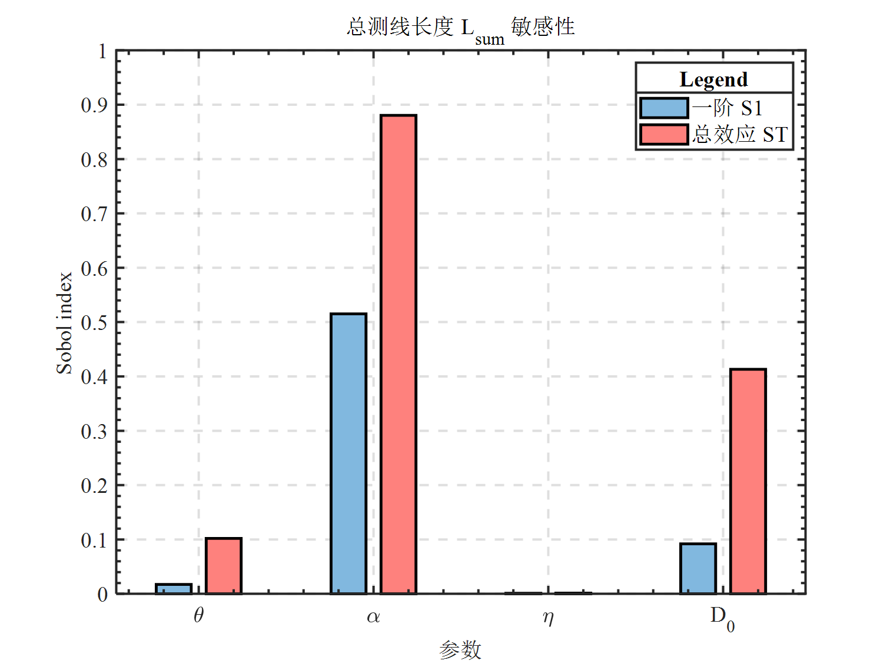

# 2023年数学建模国赛B题：多波束测线问题 | Multi-Beam Survey Line Optimization

<p align="center">
  <a href="https://opensource.org/licenses/MIT">
    
  </a>
</p>

## 🧭 项目简介 | Project Overview

本项目旨在解决多波束测深中测线优化布设问题，针对海域坡度变化与复杂地形结构，通过构建几何模型、递推算法与等效转换方法，实现对覆盖宽度、重叠率与测线间距的高效建模与优化。

> 📌 本项目为 CUMCM2023 B 题建模求解过程的完整实现，包括问题分析、模型建立、算法设计、结果可视化与模型评估。

---

## 📂 项目结构 | File Structure

```bash
.
├── stats/                           # 结果数据
├── figs/                            # 绘图相关
│
├── ARPF.py                          # 问题4：ARPF 分块拟合算法主程序
├── sensitivity_analysis.py          # 问题3：Sobol 灵敏度分析主程序
├── validate_model.py                # 问题1：几何-向量法模型检验脚本
│
├── Task1.ipynb                      # 问题1：覆盖宽度与重叠率建模实现
├── Task2.ipynb                      # 问题2：等效坡度建模与宽度矩阵计算
├── Task3.ipynb                      # 问题3：递推布线方案生成
├── Task4.ipynb                      # 问题4：复杂地形分区布设策略
│
├── plot_result3.m                   # MATLAB 绘图：问题3 布线方案与重叠率
├── plot_result4.m                   # MATLAB 绘图：问题4 全局分区布设图
├── plot_seaarea.m                   # MATLAB 绘图：海域等深线与坡度分布
├── plot_sensitivity_analysis.m      # MATLAB 绘图：Sobol 灵敏度分析柱状图
├── plot_validate_model.m            # MATLAB 绘图：模型误差对比分析
│
├── LICENSE
├── .gitignore
└── README.md
```

## 📌 模型概述与实现 | Model Implementation

### ✅ 问题一：特定位置处的覆盖宽度与重叠率计算

- 基于几何关系推导水深表达式；
- 利用正弦定理计算覆盖条带左右宽度；
- 推导重叠率表达式并生成位置-覆盖指标表格；
- 问题1的计算结果如下表所示：
<table border="1" cellspacing="0" cellpadding="5" style="text-align:center;">
  <thead>
    <tr>
      <th>测线距中心点处的距离/m</th>
      <th>-800</th><th>-600</th><th>-400</th><th>-200</th><th>0</th><th>200</th><th>400</th><th>600</th><th>800</th>
    </tr>
  </thead>
  <tbody>
    <tr>
      <td>海水深度/m</td>
      <td>90.95</td><td>85.71</td><td>80.47</td><td>75.24</td><td>70.00</td><td>64.76</td><td>59.53</td><td>54.29</td><td>49.05</td>
    </tr>
    <tr>
      <td>覆盖宽度/m</td>
      <td>315.81</td><td>297.63</td><td>279.44</td><td>261.26</td><td>243.07</td><td>224.88</td><td>206.70</td><td>188.51</td><td>170.33</td>
    </tr>
    <tr>
      <td>与前一条测线的重叠率/%</td>
      <td>—</td><td>34.68</td><td>30.56</td><td>25.88</td><td>20.53</td><td>14.34</td><td>7.11</td><td>-1.46</td><td>-11.77</td>
    </tr>
  </tbody>
</table>

|  |  |
| :--------------------------------------------------------------------------: | :------------------------------------------------------------------------------: |
|                           多波束测深系统几何示意图                          |                                海水深度测量几何示意图                                |

### ✅ 问题二：考虑测线方向影响的覆盖宽度建模

- 定义“等效坡度” $\alpha^*$；
- 将三维地形转化为二维有效坡度；
- 构建不同测线方向对应的覆盖宽度矩阵。
- 问题2的计算结果如下表所示：
<table border="1" cellspacing="0" cellpadding="5" style="text-align:center;">
  <thead>
    <tr>
      <th rowspan="2">测线方向<br>夹角<br>/°</th>
      <th colspan="8">测量船距海域中心点处的距离/海里</th>
    </tr>
    <tr>
      <th>0</th><th>0.3</th><th>0.6</th><th>0.9</th><th>1.2</th><th>1.5</th><th>1.8</th><th>2.1</th>
    </tr>
  </thead>
    <tbody>
      <tr><td>0</td><td>415.69</td><td>466.09</td><td>516.49</td><td>566.89</td><td>617.29</td><td>667.69</td><td>718.09</td><td>768.48</td></tr>
      <tr><td>45</td><td>416.19</td><td>451.87</td><td>487.55</td><td>523.23</td><td>558.91</td><td>594.59</td><td>630.27</td><td>665.95</td></tr>
      <tr><td>90</td><td>416.69</td><td>416.69</td><td>416.69</td><td>416.69</td><td>416.69</td><td>416.69</td><td>416.69</td><td>416.69</td></tr>
      <tr><td>135</td><td>416.19</td><td>380.51</td><td>344.83</td><td>309.15</td><td>273.47</td><td>237.79</td><td>202.11</td><td>166.43</td></tr>
      <tr><td>180</td><td>415.69</td><td>365.29</td><td>314.89</td><td>264.50</td><td>214.10</td><td>163.70</td><td>113.30</td><td>62.90</td></tr>
      <tr><td>225</td><td>416.19</td><td>380.51</td><td>344.83</td><td>309.15</td><td>273.47</td><td>237.79</td><td>202.11</td><td>166.43</td></tr>
      <tr><td>270</td><td>416.69</td><td>416.69</td><td>416.69</td><td>416.69</td><td>416.69</td><td>416.69</td><td>416.69</td><td>416.69</td></tr>
      <tr><td>315</td><td>416.19</td><td>451.87</td><td>487.55</td><td>523.23</td><td>558.91</td><td>594.59</td><td>630.27</td><td>665.95</td></tr>
    </tbody>
</table>

<p align="center">
  
  
</p>
<p align="center">多波束测深几何推导示意图</p>


### ✅ 问题三：测线布设最优化模型

- 几何递推法：自适应确定每条测线位置与水深；
- 保证重叠率约束，最小化测线总长度；
- 输出完整布线方案与重叠信息。
- 问题3的计算结果如下表所示：

<table border="1" cellspacing="0" cellpadding="5" style="text-align:center;">
  <thead>
    <tr>
        <th>测线序号 k</th><th>测线坐标 x<sub>k</sub></th><th>海水深度 D<sub>k</sub></th>
        <th>测线序号 k</th><th>测线坐标 x<sub>k</sub></th><th>海水深度 D<sub>k</sub></th>
    </tr>
  </thead>
  <tbody>
    <tr><td>1</td><td>358.52</td><td>197.60</td><td>18</td><td>6023.15</td><td>49.27</td></tr>
    <tr><td>2</td><td>950.55</td><td>182.10</td><td>19</td><td>6170.76</td><td>45.41</td></tr>
    <tr><td>3</td><td>1496.13</td><td>167.82</td><td>20</td><td>6306.80</td><td>41.84</td></tr>
    <tr><td>4</td><td>1998.90</td><td>154.65</td><td>21</td><td>6432.16</td><td>38.56</td></tr>
    <tr><td>5</td><td>2462.23</td><td>142.52</td><td>22</td><td>6547.69</td><td>35.54</td></tr>
    <tr><td>6</td><td>2889.22</td><td>131.34</td><td>23</td><td>6654.15</td><td>32.75</td></tr>
    <tr><td>7</td><td>3282.70</td><td>121.03</td><td>24</td><td>6752.27</td><td>30.18</td></tr>
    <tr><td>8</td><td>3645.31</td><td>111.54</td><td>25</td><td>6842.68</td><td>27.81</td></tr>
    <tr><td>9</td><td>3979.48</td><td>102.79</td><td>26</td><td>6926.00</td><td>25.63</td></tr>
    <tr><td>10</td><td>4287.43</td><td>94.72</td><td>27</td><td>7002.79</td><td>23.62</td></tr>
    <tr><td>11</td><td>4571.22</td><td>87.29</td><td>28</td><td>7073.55</td><td>21.77</td></tr>
    <tr><td>12</td><td>4832.74</td><td>80.44</td><td>29</td><td>7138.76</td><td>20.06</td></tr>
    <tr><td>13</td><td>5073.75</td><td>74.13</td><td>30</td><td>7198.85</td><td>18.48</td></tr>
    <tr><td>14</td><td>5295.85</td><td>68.32</td><td>31</td><td>7254.23</td><td>17.03</td></tr>
    <tr><td>15</td><td>5500.52</td><td>62.96</td><td>32</td><td>7305.26</td><td>15.70</td></tr>
    <tr><td>16</td><td>5689.14</td><td>58.02</td><td>33</td><td>7352.29</td><td>14.47</td></tr>
    <tr><td>17</td><td>5862.96</td><td>53.47</td><td>34</td><td>7395.63</td><td>13.33</td></tr>
  </tbody>
</table>



### ✅ 问题四：复杂地形下的自适应布线模型

- 提出 ARPF（Adaptive Recursive Plane Fitting）分区算法；
- 对三维地形进行空间线性拟合与分块建模；
- 区块内复用几何递推策略，最终合并全局测线。

|  |  |
| :--------------------------------------------------------------------------: | :------------------------------------------------------------------------------: |
|                           待测海域的深度三维曲面图                           |                                待测海域的等深线图                                |



------

## 🔬 模型检验与敏感性分析 | Model Validation & Sensitivity Analysis

- **检验方法：** 解析法与向量法逐点比对，误差为零；
- **Sobol灵敏度分析：** 使用 SALib 工具包，量化各参数对覆盖宽度与测线总长度的贡献；
- **结果可视化：** 支持 Python（matplotlib）与 MATLAB 两种绘图方式，便于论文展示。



|  |  |
| ------------------------------------------------------------------------------- | ------------------------------------------------------------------------------- |

## 📚 模型推广 | Applications & Extensions

本项目为 CUMCM2023 数学建模竞赛题目 B 的参赛实现，模型方法可拓展用于：

- 航空测绘中的激光扫描覆盖规划
- 地质勘探中的路径设计优化
- 多源传感器协同测量的布点策略

## 📧 联系我们 | Contact

如对本项目有任何建议或改进意见，欢迎通过 Issues 与我们联系。
